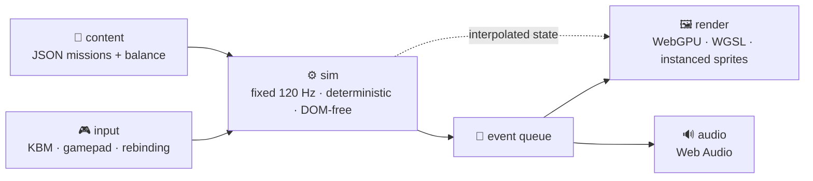

<div align="center">

# 🚁 Shoplifter

**An original 2D helicopter rescue game for the browser.**
Fly with weight, land without crushing anyone, and get finite human beings home. 🧑‍🤝‍🧑

[](docs/PRD.md)
[](https://www.typescriptlang.org/)
[](https://www.w3.org/TR/webgpu/)
[](LICENSE)

</div>

## 🎯 What this is

A spiritual successor to Dan Gorlin's 1982 _Choplifter!_ — **not a remake, not a port, no original code, art, audio, or level layouts.** 🚫📼

The design anchor is the thing everyone forgets about the original: it refused a seven-digit score. People were finite, so the only number that mattered was **how many of them lived**. 💔

| Preserved from 1982                             | Modernized                                          |
| ----------------------------------------------- | --------------------------------------------------- |
| 🧍 Finite, individually tracked civilians       | 📷 Camera look-ahead + off-screen threat indicators |
| 🔁 Repeated outbound / return extraction trips  | 🎮 Full remapping, inversion, gamepad + KBM parity  |
| ↔️ Movement independent of weapon facing        | ♿ Accessibility pass (shake, contrast, timing)     |
| 🛬 Landing and boarding are genuinely dangerous | 🎯 Deterministic 120 Hz sim + replay verification   |
| 📈 Rescues escalate the opposition              | 🔥 Damage model, flares, rockets, suppression       |

## 🧱 Stack



- **TypeScript** `strict: true` · **Vite** · native **WebGPU/WGSL** (no 3D engine)
- **Vitest** unit · **Playwright** browser smoke · ESLint + Prettier
- Simulation never touches the DOM. `Math.random()` is banned in sim. Every tunable lives in typed balance data.

## 🗺️ Roadmap

<details>
<summary><b>Milestones 0 → 5 (click to expand)</b></summary>

| #   | Milestone         | Status | Deliverable                                                           |
| --- | ----------------- | ------ | --------------------------------------------------------------------- |
| 0   | 🧰 Foundation     | ✅     | Bootable WebGPU app, CI, fixed clock, seeded RNG, debug overlay       |
| 1   | 🕹️ Flight Sandbox | ✅     | Momentum, pitch, landing tolerances, heightfield terrain              |
| 2   | 💥 Combat Sandbox | ✅     | Door gun, rockets, flares, component damage, six enemy types          |
| 3   | 🚑 Rescue Loop    | ✅     | Civilian state machine, boarding, capacity, injuries, unload, scoring |
| 4   | 🏜️ Vertical Slice | ✅     | _Operation Open Sky_ — 6 km, 24 civilians, completes end to end       |
| 5   | ✨ Polish         | 🚧     | Replay, soak, audio, particles, settings, debrief — art pass remains  |

</details>

**Target:** 60 FPS at 1080p on integrated graphics, <150 draw calls, <50 MB initial download, restart-to-control under 2 s. ⚡

## 🚀 Getting started

Requires Node 20+ and a WebGPU-capable desktop browser (Chrome/Edge 113+) on https or localhost.

```bash
npm install
npm run dev        # http://localhost:5173
npm run verify     # format + lint + typecheck + 605 unit tests + production build
npm run test:e2e   # Playwright: mission, HUD, device-loss recovery, unsupported browser
```

**Controls:** `W`/`S` lift · `A`/`D` thrust · `Q`/`E` yaw left/right through the foreground plane ·
`Space` boost · `LMB` door gun · `RMB` rockets · `F` flares · `R` interact · `Esc` pause ·
`` ` `` debug overlay.

## 📊 Where it stands

Milestones 0–4 are landed; Milestone 5 is in progress. **Operation Open Sky completes end to
end.**

| Measured                        | Result                                   | PRD budget               |
| ------------------------------- | ---------------------------------------- | ------------------------ |
| 🎞️ Frame rate (Metal 3, 1080p)  | **60.0 FPS**, 16.67 ms mean, 16.8 ms p99 | stable 60 @ 1080p        |
| 🖼️ Sprites / draw calls         | 1,577 / **1**                            | < 150 draws, target < 60 |
| ⚙️ Sim / render prep            | 0.1 ms / 0.2 ms                          | < 3 ms / < 2 ms          |
| 🚁 Full mission, scripted pilot | **22 of 24 rescued, 0 shots fired**      | 18 required              |
| ⏱️ Mission duration             | inside the 20-minute budget              | 10–12 min target         |
| 🔁 One-hour soak                | 0.8 s wall clock, **zero drift**         | no growth over an hour   |
| 🧪 Tests                        | 605 unit · 27 browser                    | —                        |
| 📦 Bundle                       | 155 kB (47 kB gzip)                      | < 50 MB initial          |

> [!NOTE]
> The scripted pilot in `src/debug/autopilot.ts` flies the whole mission without firing once —
> that is an assertion, not a boast. The PRD requires the slice be completable without clearing
> the map, so it is a test.

Full spec: **[docs/PRD.md](docs/PRD.md)** · plan: **[docs/IMPLEMENTATION_PLAN.md](docs/IMPLEMENTATION_PLAN.md)** · decisions: **[docs/DECISIONS.md](docs/DECISIONS.md)**

## ⚖️ Legal

Mechanics are documented for research and inspiration. No _Choplifter_ name, trademark, artwork, audio, text, source, or level geometry is used or redistributed here. Code in this repo is MIT licensed.
