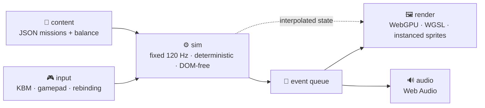

# 🚁 Shoplifter

**An original 2D helicopter rescue game for the browser.**
Fly with weight, land without crushing anyone, and get finite human beings home. 🧑‍🤝‍🧑

## 🎯 What this is

A spiritual successor to Dan Gorlin's 1982 *Choplifter!* — **not a remake, not a port, no original code, art, audio, or level layouts.** 🚫📼

The design anchor is the thing everyone forgets about the original: it refused a seven-digit score. People were finite, so the only number that mattered was **how many of them lived**. 💔

| Preserved from 1982 | Modernized |
|---|---|
| 🧍 Finite, individually tracked civilians | 📷 Camera look-ahead + off-screen threat indicators |
| 🔁 Repeated outbound / return extraction trips | 🎮 Full remapping, inversion, gamepad + KBM parity |
| ↔️ Movement independent of weapon facing | ♿ Accessibility pass (shake, contrast, timing) |
| 🛬 Landing and boarding are genuinely dangerous | 🎯 Deterministic 120 Hz sim + replay verification |
| 📈 Rescues escalate the opposition | 🔥 Damage model, flares, rockets, suppression |

## 🧱 Stack

- **TypeScript** `strict: true` · **Vite** · native **WebGPU/WGSL** (no 3D engine)
- **Vitest** unit · **Playwright** browser smoke · ESLint + Prettier
- Simulation never touches the DOM. `Math.random()` is banned in sim. Every tunable lives in typed balance data.

## 🗺️ Roadmap

<b>Milestones 0 → 5 (click to expand)</b>

| # | Milestone | Deliverable |
|---|---|---|
| 0 | 🧰 Foundation | Bootable WebGPU app, CI, fixed clock, seeded RNG, debug overlay |
| 1 | 🕹️ Flight Sandbox | Helicopter with momentum, pitch, landing contacts, hot-reloaded tuning |
| 2 | 💥 Combat Sandbox | Door gun, rockets, flares, damage, 5 enemies + drone |
| 3 | 🚑 Rescue Loop | Civilian state machine, boarding, capacity, injuries, unload, scoring |
| 4 | 🏜️ Vertical Slice | *Operation Open Sky* — 6 km Salt Flats map, launch to debrief |
| 5 | ✨ Polish | Art/audio, accessibility, save, replay, perf budgets |

**Target:** 60 FPS at 1080p on integrated graphics, <150 draw calls, <50 MB initial download, restart-to-control under 2 s. ⚡

## 🚀 Getting started

> [!NOTE]
> Milestone 0 is not landed yet — there is no `package.json` in the tree. The full spec lives in **[docs/PRD.md](docs/PRD.md)**.

Requires a WebGPU-capable desktop browser (Chrome/Edge) and a secure context.

## ⚖️ Legal

Mechanics are documented for research and inspiration. No *Choplifter* name, trademark, artwork, audio, text, source, or level geometry is used or redistributed here. Code in this repo is MIT licensed.
